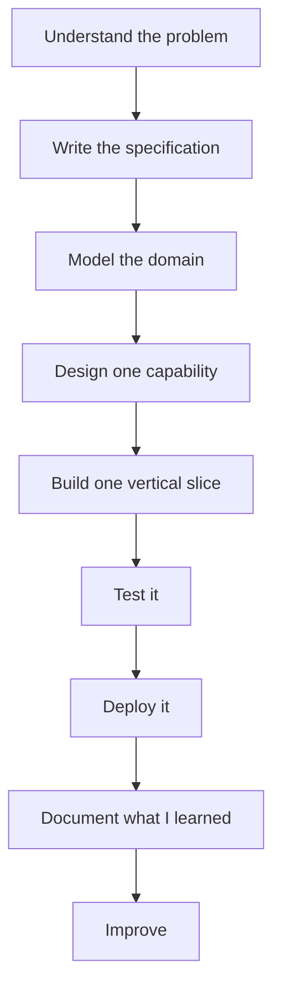
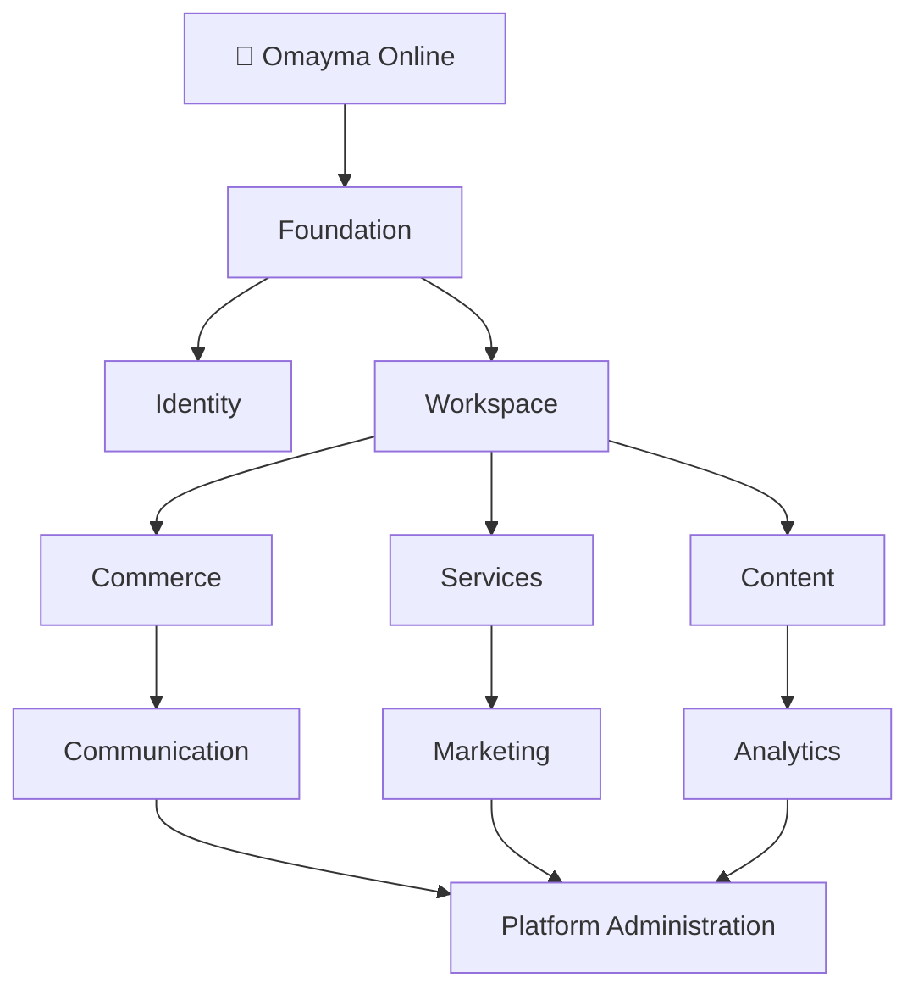
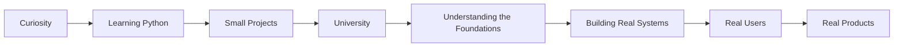

# 🌸 Omayma

> **Learn something deeply. Build something real. Share what you discover.**

I'm a Computer Science student building software systems that help people and businesses **understand, establish, build, organise, and grow their online presence**.

I learn by building real things, documenting what I discover, and turning what I learn into systems that can actually be used.

---

## 🏡 Omayma Online

**Omayma Online (OO)** is my living digital workspace and the first serious platform I'm building for myself — and eventually for anyone who finds it useful.

The idea is simple: OO is being designed as a long-term system rather than a collection of isolated pages or portfolio demonstrations.

Every capability is built to be:

* useful;
* understandable;
* maintainable;
* testable;
* and capable of evolving.

### 🌐 Explore Omayma Online

**[Live Workspace](https://omaymaonline.super.site)**

The platform is currently under construction.

For now, the workspace serves as the public home for the documentation, writing, resources, experiments, and progress surrounding the project.

---

## 🌱 Learn Alongside Me

I'm not building this project because I already know everything required to build it.

I'm building it because I want to **learn how to build real systems properly**.

The journey covers things such as:

* Computer Science fundamentals;
* software architecture;
* domain-driven design;
* databases;
* APIs;
* testing;
* security;
* deployment;
* project management;
* product development.

The goal isn't to collect technologies.

It's to understand **why systems work, how they should be designed, and how to make them keep working as they grow.**

If you're learning too, you're welcome to follow along.

**[Read the journey →](https://omaymaonline.super.site)**

---

## 🛠️ How I Build

I previously made the mistake of letting technology drive the project.

I started with a large stack (next.js, tailwind, CSS, JavaScript, React.js, HTML,...), learned pieces of several technologies at once, and eventually reached the point where I could no longer clearly explain the system I was building.

That first attempt taught me something important:

> **Using more technology does not automatically mean building a better system.**

[Check my first attempt](https://github.com/omaymaonline/first-attempt)

I decided to step back, return to what I already understand, and rebuild my approach from stronger foundations.

So I'm taking a different approach:



The technology is chosen **after understanding what the system needs**.

The programming language I'm focusing on right now is **Python**.

Not because it is the only language worth learning, but because I already know it well enough to stop constantly changing tools and start pushing my engineering ability further.

**The tool should serve the system.**

---

## 🏗️ The Platform

Omayma Online is being developed around separate business capabilities:



The architecture is designed before implementation so that new capabilities can be added without turning the system into an increasingly tangled collection of features.

Implementation follows complete vertical slices:

```text
Database
   ↓
Domain
   ↓
Application
   ↓
API
   ↓
Interface
   ↓
Tests
   ↓
Working capability
```

The result should be something I can actually use, not something that merely looks good in a screenshot.

---

## 💡 What I'm Building Toward

I'm interested in the space between **real problems and useful software**.

That includes:

* online presence systems;
* business tools;
* SaaS products;
* educational software;
* automation;
* internal tools;
* developer tools;
* and eventually, products that can become businesses themselves.

If you have a business, project, or idea and like the way I approach software, **I'd love to hear from you.**

---

## 🤝 Work With Me

I work with people who want to build something useful.

That might be:

* establishing an online presence;
* organizing an existing digital operation;
* turning an idea into a working system;
* automating repetitive work;
* or building software around a real business need.

I care less about making another generic website and more about understanding **what the system is actually supposed to accomplish**.

**[Let's connect →](mailto:omayma.online@gmail.com)**

---

## 🐍 Engineering

I'm deliberately keeping my programming-language surface small while strengthening the foundations underneath it.

| Area         | Focus                                        |
| ------------ | -------------------------------------------- |
| Language     | **Python**                                   |
| Architecture | Domain-Driven Design · Software Architecture |
| Data         | PostgreSQL · Database Design                 |
| APIs         | REST                                         |
| Quality      | Automated Testing                            |
| Engineering  | Git · Documentation · Project Management     |

The stack will evolve when the system requires it.

I don't want a technology collection.

**I want an engineering foundation.**

---

## 📚 From Learning to Building

My journey has roughly moved through:



**[🐍 Learning Python — Small Projects](https://github.com/omaymaonline/small-projects)**

Omayma Online is where those paths meet.

I learn.

I build.

I document.

I share.

Then I use what I learned to build something better.

---

## 🌸 The Principle

I don't want to say:

> **"I can build this."**

I'd rather build it and let you see it.

> **You're not looking at a portfolio.**
>
> **You're already inside it.**

---

## 🔗 Find Me

|                      |                                                                           |
| -------------------- | ------------------------------------------------------------------------- |
| 🌸 **Omayma Online** | [omaymaonline.super.site](https://omaymaonline.super.site)                |
| 💻 **GitHub**        | [github.com/omaymaonline](https://github.com/omaymaonline)                |
| 💼 **LinkedIn**      | [linkedin.com/in/omaymaonline](https://www.linkedin.com/in/omaymaonline/) |
| 📷 **Instagram**     | [@omaymaonline](https://www.instagram.com/omaymaonline/)                  |
| 💬 **Facebook**      | [@onlineomayma](https://www.facebook.com/onlineomayma/)                   |
| ✉️ **Email**         | [omayma.online@gmail.com](mailto:omayma.online@gmail.com)                 |

---

## 📈 This Repository

This repository will evolve alongside the project.

The commits, documentation, experiments, architecture, and eventually the working platform should tell the story.

**This isn't the finished portfolio.**

**It's the beginning of the build.**

السلام عليكم، Peace Be Upon You.
