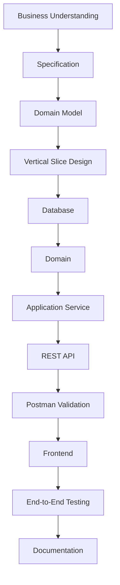
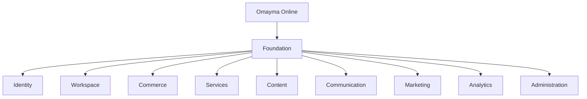
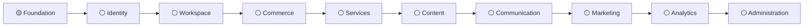

  

<i>Designing thoughtful software. Building in public. Learning for life.</i>

---

# 🌸 About Me

I'm a Computer Science student designing and building software systems that help entrepreneurs understand, operate, and grow their businesses.

I believe software should be **clear**, **maintainable**, and **built to last**.

Rather than collecting finished projects, I'm documenting the complete journey—from first idea to production-ready implementation—so every step becomes part of a living portfolio.

> **You're not looking at a portfolio.**
>
> **You're already inside the system I build.**

---

# 🚀 Current Focus

## Omayma Online

A domain-driven platform that helps entrepreneurs transform business ideas into structured, scalable digital businesses.

Every capability is implemented as a complete production-ready vertical slice, documented from specification to deployment.

### Repository

➡️ **https://github.com/omaymaonline**

### Live Workspace

➡️ **https://omaymaonline.super.site**

(Currently serving as the public documentation, blog, and project workspace while the platform is under construction.)

---

# 🌱 Currently Learning

- Computer Science Fundamentals
  - Algorithms
  - Operating Systems
  - Database Systems
  - Computer Architecture
- Domain-Driven Design
- Software Architecture
- Next.js
- TypeScript
- PostgreSQL
- Production SaaS Engineering

---

# 🌸 Engineering Workflow

---

# 🌸 Omayma Online Architecture

---

# 🌸 Roadmap

---

# 🤝 Open to Collaborate

- Educational software
- Open-source developer tools
- SaaS architecture discussions
- Domain-Driven Design
- Projects that help small businesses adopt technology

---

# 💬 Ask Me About

- Software Architecture
- Domain-Driven Design
- SaaS Engineering
- Building in Public
- Production-ready Systems
- Turning Software into Living Portfolios

---

# ⚡ Fun Fact

> My portfolio isn't a collection of screenshots.

Every feature I build becomes part of the product that demonstrates how I build software.

---

# 🛠 Tech Stack

### Languages

### Frontend

### Backend & Database

### Infrastructure

### Tools

---

# 🌐 Connect

---

# 📈 GitHub Activity

> GitHub statistics will be added once the public repositories better reflect the engineering journey.

---

<i>Building one production-ready vertical slice at a time 🌸</i>

<!-- ===========================================================
Developer Notes (private reminders)

As Omayma Online grows, this README should become lighter.

The goal is for the repositories, documentation, architecture,
blog, and platform itself to become the proof.

Eventually:
- Replace text sections with branded SVG illustrations.
- Replace roadmap text with a visual roadmap.
- Replace workflow text with an engineering pipeline illustration.
- Replace architecture description with an interactive domain map.
- Let repositories and documentation speak for themselves.

The README should evolve from
"explaining everything"
into
"a beautiful front door."

If this README feels shorter in the future,
that's a sign the platform has matured.
=========================================================== -->
